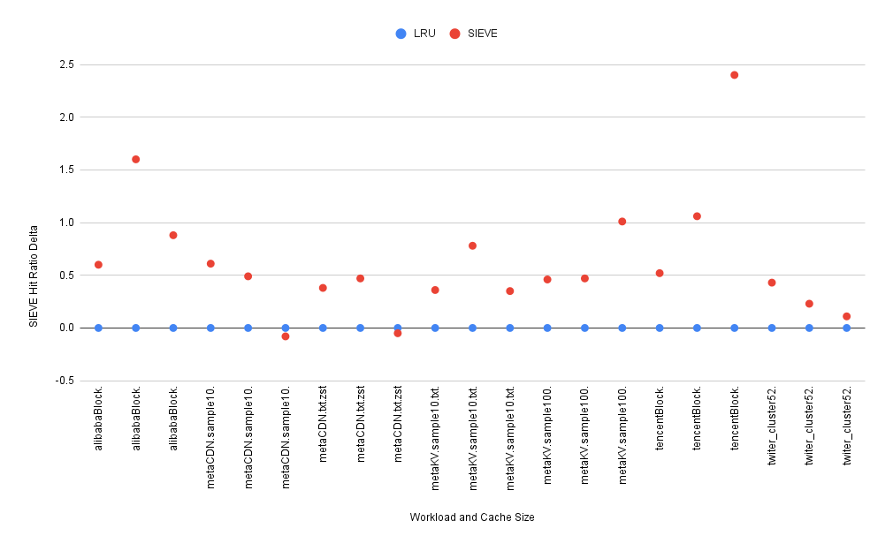
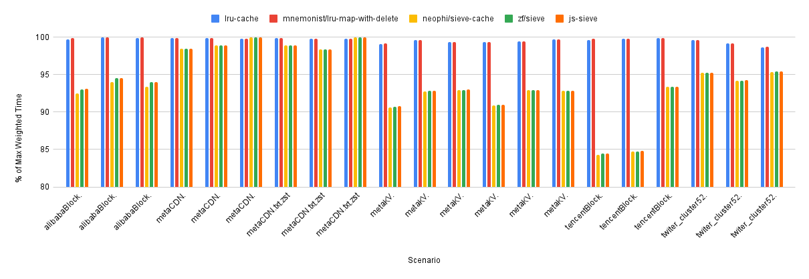
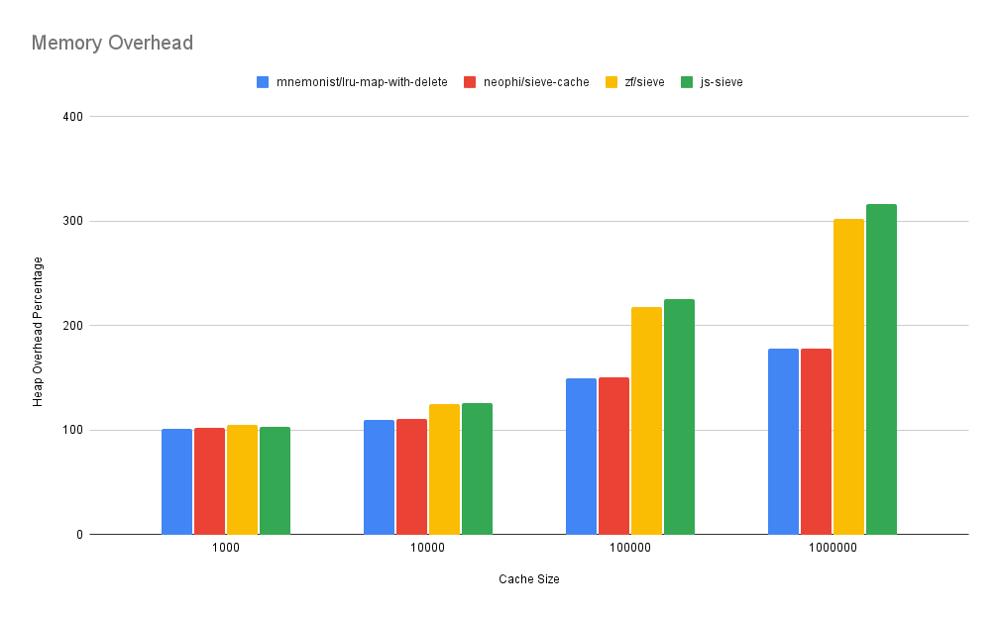

# Cache Playground

The goal of this project is to provide a set of common tools to evaluate and experiment with different in-memory key/value caching algorithms and implementations written for JavaScript runtimes. The focus is primarily for server side in-memory caching with browser support noted if known. The playground includes benchmarks but these have varying degrees of confidence explained below.

Unless otherwise noted the playground has only been tested with Node `v20.11.1`.

### Setup

```
yarn install
yarn dist
```

## Key Considerations

Picking an in-memory cache implementation is highly dependent on the workload that will be used against it and the required features.

### Workload

Understanding how the cache will be used is critical to picking an algorithm that will result in the best results for a given use case.

- total key set size: how many unique keys could be used to access the cache
- working key set size: of all keys how many are typically needed to perform operations
- support for key scanning: does your workload scan over large number of keys at a time resulting in many single access requests
- key access distribution: is key access random, power-law, sequential, bimodal

### Implementation

Because pure JavaScript does not have low-level memory manipulation, common data structures like pointers used to implement caches in other languages require different approaches which result in various tradeoffs.

- cache restriction mechanisms: total key count or support for approximate value size
- bookkeeping overhead: data used by the cache that isn't the raw key and values
- operation overhead: speed of get, set, and eviction operations
- arbitrary key delete support: ability to delete an arbitrary key
- data types supported: restrictions on type of data keys and/or values can be used

## Evaluation

Caches are evaluated with the following caveats:

- Input strings are used for the keys and values. This is done to support testing the widest range of implementations which often require keys to be strings. Additionally this allows approximation of memory overhead.
- Restrictions based on key count only. This is done to support testing the widest range of implementations which do not all support limiting total cache size based on approximated memory usage of values and/or keys.

### Hit Ratio (High Confidence)

For a given workload and a cache of a certain size we can measure the hit ratio of the cache. That is how often when we get a value from the cache it is already there. This is a deterministic measurement so we have high confidence when comparing different algorithms, provided no randomness is involved in the caching algorithm. If randomness is involved, pseudorandom number generators with seed support or used to ensure repeatability and many iterations should be examined.

### Mean Operation Time (Medium Confidence)

For a given implementation of an algorithm how quickly does it perform a given workload as measured in mean time per operation. Macrobenchmarks are used to ensure any runtime optimizations and garbage collection overhead are factored in. While microbenchmarks play a role, their variability, especially in modern JIT is not the intent of this project.

### Memory Overhead (Low Confidence)

Accurately measuring the memory of a JavaScript object is tricky since so much is handled by the runtime. The goal is to compare the minimal space needed against an implementation to estimate the memory overhead.

## Workloads

The playground uses a combination of captured workloads and simulated repeatable workloads.

### Captured

A number of high quality cache captures are available online at [https://ftp.pdl.cmu.edu/pub/datasets/twemcacheWorkload/txt/](https://ftp.pdl.cmu.edu/pub/datasets/twemcacheWorkload/txt/). These were originally published as part of the [SIEVE paper](papers/nsdi24-SIEVE.pdf).

The following workloads are used below.

| workload                           |   totalKeys | uniqueKeys | uniquePercent |      1% |       10% |       25% |
| ---------------------------------- | ----------: | ---------: | ------------: | ------: | --------: | --------: |
| alibabaBlock.sample100.txt.zst     | 192,929,855 |  8,909,997 |         4.62% |  89,100 |   891,000 | 2,227,499 |
| metaCDN.sample10.txt.zst           |   3,458,656 |  1,223,793 |        35.38% |  12,238 |   122,379 |   305,948 |
| metaCDN.txt.zst                    |  45,623,306 | 12,245,127 |        26.84% | 122,451 | 1,224,513 | 3,061,282 |
| metaKV.sample10.txt.zst            | 171,291,137 |  5,197,497 |         3.03% |  51,975 |   519,750 | 1,299,374 |
| metaKV.sample100.txt.zst           |  13,124,093 |    520,066 |         3.96% |   5,201 |    52,007 |   130,017 |
| tencentBlock.sample100.txt.zst     |  28,746,409 |  5,258,664 |        18.29% |  52,587 |   525,866 | 1,314,666 |
| twiter_cluster52.sample100.txt.zst | 141,072,073 |  2,511,546 |         1.78% |  25,115 |   251,155 |   627,887 |

### Simulated

These are primarily based on a [power law approximation](papers/0706.1062v2.pdf) or [Zipf's law](https://en.wikipedia.org/wiki/Zipf's_law).

#### Power Law

`node dist/src/power-law.js`

| ENV        | Default | Meaning                                      |
| ---------- | ------- | -------------------------------------------- |
| X_MIN      | 5       | Minimum integer value                        |
| ALPHA      | 2.5     | [Power law exponent](papers/0706.1062v2.pdf) |
| SEED       | 9,954   | mersenne-twister random seed                 |
| ITERATIONS | 10,000  | How many values to produce                   |

#### Zipf's Law

`node dist/src/zipf.js`

| ENV        | Default | Meaning                                                                                    |
| ---------- | ------- | ------------------------------------------------------------------------------------------ |
| X_MIN      | 1       | Minimum integer value                                                                      |
| X_MAX      | 1,000   | Maximum integer value                                                                      |
| SKEW       | 1.07    | [Skew towards X_MIN](https://github.com/vweevers/zipfian-integer?tab=readme-ov-file#about) |
| SEED       | 9,954   | mersenne-twister random seed                                                               |
| ITERATIONS | 10,000  | How many values to produce                                                                 |

## Running

To provide as much flexibility in workload generation the tools read a series of newline delimited keys (typically integers but could be anything) from STDIN and runs them against a comma separated list of cache names to test or all registered caches if none are specified. Caches are defined in [src/caches.ts](src/caches.ts).

### Hit Ratio

`node dist/src/hit-ratio.js`

| ENV         | Default | Meaning                           |
| ----------- | ------- | --------------------------------- |
| CACHE_NAMES |         | Caches to include in the run      |
| CACHE_SIZE  | 100     | Limit on number keys in the cache |

Sample simulated workload:

```
node dist/src/power-law.js | node dist/src/hit-ratio.js
Using 2.5 for ALPHA
Using 5 for X_MIN
Using 9,954 for SEED
Using 10,000 for ITERATIONS
Using 100 for CACHE_SIZE
┌───────────────────────────────┬──────────┬──────────┐
│ (index)                       │ hitCount │ hitRatio │
├───────────────────────────────┼──────────┼──────────┤
│ playground/lru-uint           │ 9779     │ '97.79%' │
│ playground/sieve-uint         │ 9789     │ '97.89%' │
└───────────────────────────────┴──────────┴──────────┘
```

Sample captured workload:

```
zstd -cd datasets/twemcacheWorkload/txt/metaKV.sample100.txt.zst | env CACHE_SIZE=100000 CACHE_NAME=node dist/src/ops.js
Using 10,000 for CACHE_SIZE
┌───────────────────────────────┬──────────┬──────────────┐
│ (index)                       │ hitCount │ hitRatio     │
├───────────────────────────────┼──────────┼──────────────┤
│ playground/lru-uint           │ 11583908 │ '88.264446%' │
│ playground/sieve-uint         │ 11679236 │ '88.990805%' │
└───────────────────────────────┴──────────┴──────────────┘
```

### Mean Operation Time

All times are reported in nanoseconds.

`node dist/src/ops.js`

| ENV          | Default       | Meaning                                   |
| ------------ | ------------- | ----------------------------------------- |
| CACHE_NAME   |               | Cache to use                              |
| CACHE_SIZE   | 100           | Limit on number keys in the cache         |
| OPS_OUTPUT   | table         | `json` for JSON, default is console table |
| OPS_WORKLOAD | not specified | workload name to include in JSON output   |

```
zstd -cd datasets/twemcacheWorkload/txt/metaKV.sample100.txt.zst | env CACHE_SIZE=100000 CACHE_NAME=playground/sieve-uint node dist/src/ops.js
Using playground/sieve-uint for CACHE_NAME
Using 100,000 for CACHE_SIZE
┌─────────┬──────────────┬───────┐
│ (index) │ count        │ mean  │
├─────────┼──────────────┼───────┤
│ get     │ '13,124,093' │ '215' │
│ set     │ '696,637'    │ '458' │
└─────────┴──────────────┴───────┘
```

### Memory Overhead

The `process.memoryUsage().heapUsed` in bytes is reported. For calculation of overhead compare against a plain `map` or `object` based on the underlying implementation. The optional `--expose-gc` to node must be passed. The overhead is HIGHLY dependent on the size and type of the keys so customize for your use case.

`node --expose-gc dist/src/memory.js`

| ENV        | Default | Meaning                                 |
| ---------- | ------- | --------------------------------------- |
| CACHE_NAME |         | Cache to use                            |
| CACHE_SIZE | 100     | Limit on number keys in the cache       |
| MEM_OUTPUT | log     | `json` for JSON, default is console log |

```
env CACHE_SIZE=100000 CACHE_NAME=playground/sieve-uint node --expose-gc dist/src/memory.js
Using playground/sieve-uint for CACHE_NAME
Using 100,000 for CACHE_SIZE
15,969,936

env CACHE_SIZE=100000 CACHE_NAME=map node --expose-gc dist/src/memory.js
Using map for CACHE_NAME
Using 100,000 for CACHE_SIZE
10,660,632
```

So in the case of the `playground/sieve-uint` cache the overhead for a `100,000` item string cache is apx. `5,309,304 bytes`.

## Results

All results reported below were captured on a DigitalOcean CPU-Optimized 2 vCPUs machine running Debian 12 and node v20.11.1. Full details in [benchmark.md](benchmark.md). The raw data can be found in the [results](results/) directory.

### Implementations

Any mistakes in classification are mine and corrections are welcome.

| Name                                                                          | Version | Type  | Core HashMap | Notes                         |
| ----------------------------------------------------------------------------- | ------- | ----- | ------------ | ----------------------------- |
| [tiny-lru](https://github.com/avoidwork/tiny-lru)                             | 11.2.5  | LRU   | Object       |                               |
| [lru-cache](https://github.com/isaacs/node-lru-cache)                         | 10.2.0  | LRU   | Map          |                               |
| [playground/lru-uint](playground/lru-uint.ts)                                 | N/A     | LRU   | Map          |                               |
| [mnemonist/lru-cache-with-delete](https://github.com/yomguithereal/mnemonist) | 0.39.8  | LRU   | Object       |                               |
| [mnemonist/lru-map-with-delete](https://github.com/yomguithereal/mnemonist)   | 0.39.8  | LRU   | Map          |                               |
| [js-sieve](playground/js-sieve.ts)                                            | 0.0.4\* | SIEVE | Map          | Modified interface            |
| [neophi/sieve-cache](https://github.com/NeoPhi/sieve-cache)                   | 1.0.1   | SIEVE | Map          |                               |
| [playground/sieve-map-entry](playground/sieve-map-entry.ts)                   | N/A     | SIEVE | Map          |                               |
| [zf/sieve](playground/zf-sieve-cache.ts)                                      | 1.0.?\* | SIEVE | Map          | Copied and modified interface |

### Hit Ratio

Each workload was tested at 1%, 10%, and 25% of the unique keys seen in the entire workload. A higher hit ratio is better. All hit ratios are calculated based on a cold cache, that is with the cache starting with no data. Given the different access nature of the workloads the hit ratio varies dramatically.



| workload                           | cacheSize | algorithm | hitRatio |
| :--------------------------------- | --------: | :-------: | -------: |
| alibabaBlock.sample100.txt.zst     |    89,100 |    LRU    |    73.55 |
| alibabaBlock.sample100.txt.zst     |    89,100 |   SIEVE   |    75.15 |
| alibabaBlock.sample100.txt.zst     |   891,000 |    LRU    |    87.10 |
| alibabaBlock.sample100.txt.zst     |   891,000 |   SIEVE   |    87.98 |
| alibabaBlock.sample100.txt.zst     | 2,227,499 |    LRU    |    91.99 |
| alibabaBlock.sample100.txt.zst     | 2,227,499 |   SIEVE   |    92.59 |
| metaCDN.sample10.txt.zst           |    12,238 |    LRU    |    49.52 |
| metaCDN.sample10.txt.zst           |    12,238 |   SIEVE   |    50.01 |
| metaCDN.sample10.txt.zst           |   122,379 |    LRU    |    57.06 |
| metaCDN.sample10.txt.zst           |   122,379 |   SIEVE   |    57.67 |
| metaCDN.sample10.txt.zst           |   305,948 |    LRU    |    60.91 |
| metaCDN.sample10.txt.zst           |   305,948 |   SIEVE   |    60.83 |
| metaCDN.txt.zst                    |   122,451 |    LRU    |    61.68 |
| metaCDN.txt.zst                    |   122,451 |   SIEVE   |    62.06 |
| metaCDN.txt.zst                    | 1,224,513 |    LRU    |    67.40 |
| metaCDN.txt.zst                    | 1,224,513 |   SIEVE   |    67.87 |
| metaCDN.txt.zst                    | 3,061,282 |    LRU    |    70.34 |
| metaCDN.txt.zst                    | 3,061,282 |   SIEVE   |    70.29 |
| metaKV.sample10.txt.zst            |    51,975 |    LRU    |    88.70 |
| metaKV.sample10.txt.zst            |    51,975 |   SIEVE   |    89.48 |
| metaKV.sample10.txt.zst            |   519,750 |    LRU    |    94.64 |
| metaKV.sample10.txt.zst            |   519,750 |   SIEVE   |    94.99 |
| metaKV.sample10.txt.zst            | 1,299,374 |    LRU    |    95.87 |
| metaKV.sample10.txt.zst            | 1,299,374 |   SIEVE   |    96.23 |
| metaKV.sample100.txt.zst           |     5,201 |    LRU    |    85.34 |
| metaKV.sample100.txt.zst           |     5,201 |   SIEVE   |    86.35 |
| metaKV.sample100.txt.zst           |    52,007 |    LRU    |    93.00 |
| metaKV.sample100.txt.zst           |    52,007 |   SIEVE   |    93.47 |
| metaKV.sample100.txt.zst           |   130,017 |    LRU    |    94.61 |
| metaKV.sample100.txt.zst           |   130,017 |   SIEVE   |    95.07 |
| tencentBlock.sample100.txt.zst     |    52,587 |    LRU    |    63.31 |
| tencentBlock.sample100.txt.zst     |    52,587 |   SIEVE   |    65.71 |
| tencentBlock.sample100.txt.zst     |   525,866 |    LRU    |    93.02 |
| tencentBlock.sample100.txt.zst     |   525,866 |   SIEVE   |    94.08 |
| tencentBlock.sample100.txt.zst     | 1,314,666 |    LRU    |    96.67 |
| tencentBlock.sample100.txt.zst     | 1,314,666 |   SIEVE   |    97.19 |
| twiter_cluster52.sample100.txt.zst |    25,115 |    LRU    |    90.26 |
| twiter_cluster52.sample100.txt.zst |    25,115 |   SIEVE   |    90.69 |
| twiter_cluster52.sample100.txt.zst |   251,155 |    LRU    |    95.36 |
| twiter_cluster52.sample100.txt.zst |   251,155 |   SIEVE   |    95.59 |
| twiter_cluster52.sample100.txt.zst |   627,887 |    LRU    |    96.80 |
| twiter_cluster52.sample100.txt.zst |   627,887 |   SIEVE   |    96.91 |

### Mean Operation Time

Presented in alphabetical order. `getMean`, `setMean`, `totalTime`, and `weightedTotalTime` are all in nanoseconds. `weightedTotalTime` considers a cache miss to have a 1 millisecond overhead. A subset of results are presented in the graph.



| workload                           |     cacheSize |            cacheName            |     getMean |     setMean |         totalTime |     weightedTotalTime |     percentOfMaxTotalTime |     percentOfMaxWeightedTotalTime |
| :--------------------------------- | ------------: | :-----------------------------: | ----------: | ----------: | ----------------: | --------------------: | ------------------------: | --------------------------------: |
| alibabaBlock.sample100.txt.zst     |        89,100 |            js-sieve             |       4,552 |       5,845 | 1,158,407,664,195 |    49,095,270,664,195 |                    100.00 |                             94.52 |
| alibabaBlock.sample100.txt.zst     |        89,100 |            lru-cache            |       2,599 |       7,620 |   890,281,050,305 |    51,921,299,050,305 |                     76.85 |                             99.96 |
| alibabaBlock.sample100.txt.zst     |        89,100 | mnemonist/lru-cache-with-delete |         326 |       1,083 |   118,161,725,224 |    51,149,179,725,224 |                     10.20 |                             98.48 |
| alibabaBlock.sample100.txt.zst     |        89,100 |  mnemonist/lru-map-with-delete  |       2,635 |       7,595 |   895,950,749,635 |    51,926,968,749,635 |                     77.34 |                             99.98 |
| alibabaBlock.sample100.txt.zst     |        89,100 |       neophi/sieve-cache        |       3,266 |       5,760 |   906,225,237,310 |    48,843,088,237,310 |                     78.23 |                             94.04 |
| alibabaBlock.sample100.txt.zst     |        89,100 |       playground/lru-uint       |       2,656 |       7,762 |   908,524,456,596 |    51,939,542,456,596 |                     78.43 |                            100.00 |
| alibabaBlock.sample100.txt.zst     |        89,100 |   playground/sieve-map-entry    |       3,241 |       5,356 |   882,035,498,283 |    48,818,898,498,283 |                     76.14 |                             93.99 |
| alibabaBlock.sample100.txt.zst     |        89,100 |            tiny-lru             |         596 |       1,102 |   171,222,375,416 |    51,202,240,375,416 |                     14.78 |                             98.58 |
| alibabaBlock.sample100.txt.zst     |        89,100 |            zf/sieve             |       4,501 |       5,785 | 1,145,692,029,810 |    49,082,555,029,810 |                     98.90 |                             94.50 |
| alibabaBlock.sample100.txt.zst     |       891,000 |            js-sieve             |       4,484 |       5,037 |   981,918,097,357 |    24,174,419,097,357 |                    100.00 |                             94.03 |
| alibabaBlock.sample100.txt.zst     |       891,000 |            lru-cache            |       3,303 |       6,142 |   790,096,128,061 |    25,675,934,128,061 |                     80.46 |                             99.87 |
| alibabaBlock.sample100.txt.zst     |       891,000 | mnemonist/lru-cache-with-delete |         501 |       1,466 |   133,140,495,863 |    25,018,978,495,863 |                     13.56 |                             97.32 |
| alibabaBlock.sample100.txt.zst     |       891,000 |  mnemonist/lru-map-with-delete  |       3,407 |       6,184 |   811,206,038,177 |    25,697,044,038,177 |                     82.61 |                             99.96 |
| alibabaBlock.sample100.txt.zst     |       891,000 |       neophi/sieve-cache        |       3,664 |       5,019 |   823,298,151,239 |    24,015,799,151,239 |                     83.85 |                             93.42 |
| alibabaBlock.sample100.txt.zst     |       891,000 |       playground/lru-uint       |       3,441 |       6,381 |   822,668,163,333 |    25,708,506,163,333 |                     83.78 |                            100.00 |
| alibabaBlock.sample100.txt.zst     |       891,000 |   playground/sieve-map-entry    |       3,703 |       4,425 |   817,046,069,990 |    24,009,547,069,990 |                     83.21 |                             93.39 |
| alibabaBlock.sample100.txt.zst     |       891,000 |            tiny-lru             |         801 |       1,468 |   191,069,224,039 |    25,076,907,224,039 |                     19.46 |                             97.54 |
| alibabaBlock.sample100.txt.zst     |       891,000 |            zf/sieve             |       4,430 |       4,883 |   967,928,240,033 |    24,160,429,240,033 |                     98.58 |                             93.98 |
| alibabaBlock.sample100.txt.zst     |     2,227,499 |            js-sieve             |       3,237 |       2,854 |   665,301,499,199 |    14,956,667,499,199 |                    100.00 |                             93.11 |
| alibabaBlock.sample100.txt.zst     |     2,227,499 |            lru-cache            |       2,677 |       3,938 |   577,297,683,533 |    16,022,818,683,533 |                     86.77 |                             99.75 |
| alibabaBlock.sample100.txt.zst     |     2,227,499 | mnemonist/lru-cache-with-delete |         550 |       1,593 |   130,716,135,203 |    15,576,237,135,203 |                     19.65 |                             96.97 |
| alibabaBlock.sample100.txt.zst     |     2,227,499 |  mnemonist/lru-map-with-delete  |       2,774 |       3,958 |   596,320,789,888 |    16,041,841,789,888 |                     89.63 |                             99.87 |
| alibabaBlock.sample100.txt.zst     |     2,227,499 |       neophi/sieve-cache        |       2,723 |       2,720 |   564,220,510,685 |    14,855,586,510,685 |                     84.81 |                             92.48 |
| alibabaBlock.sample100.txt.zst     |     2,227,499 |       playground/lru-uint       |       2,866 |       4,179 |   617,483,796,689 |    16,063,004,796,689 |                     92.81 |                            100.00 |
| alibabaBlock.sample100.txt.zst     |     2,227,499 |   playground/sieve-map-entry    |       2,757 |       2,458 |   567,035,787,863 |    14,858,401,787,863 |                     85.23 |                             92.50 |
| alibabaBlock.sample100.txt.zst     |     2,227,499 |            tiny-lru             |         882 |       1,710 |   196,575,973,020 |    15,642,096,973,020 |                     29.55 |                             97.38 |
| alibabaBlock.sample100.txt.zst     |     2,227,499 |            zf/sieve             |       3,192 |       2,777 |   655,519,220,542 |    14,946,885,220,542 |                     98.53 |                             93.05 |
| **workload**                       | **cacheSize** |          **cacheName**          | **getMean** | **setMean** |     **totalTime** | **weightedTotalTime** | **percentOfMaxTotalTime** | **percentOfMaxWeightedTotalTime** |
| metaCDN.sample10.txt.zst           |        12,238 |            js-sieve             |         173 |         418 |     1,321,017,238 |     1,730,196,017,238 |                     44.08 |                             98.93 |
| metaCDN.sample10.txt.zst           |        12,238 |            lru-cache            |         152 |         329 |     1,100,146,751 |     1,747,091,146,751 |                     36.71 |                             99.89 |
| metaCDN.sample10.txt.zst           |        12,238 | mnemonist/lru-cache-with-delete |         254 |         917 |     2,479,572,371 |     1,748,470,572,371 |                     82.73 |                             99.97 |
| metaCDN.sample10.txt.zst           |        12,238 |  mnemonist/lru-map-with-delete  |         150 |         294 |     1,032,119,754 |     1,747,023,119,754 |                     34.44 |                             99.89 |
| metaCDN.sample10.txt.zst           |        12,238 |       neophi/sieve-cache        |         159 |         327 |     1,115,268,429 |     1,729,990,268,429 |                     37.21 |                             98.91 |
| metaCDN.sample10.txt.zst           |        12,238 |       playground/lru-uint       |         153 |         323 |     1,093,129,461 |     1,747,084,129,461 |                     36.47 |                             99.89 |
| metaCDN.sample10.txt.zst           |        12,238 |   playground/sieve-map-entry    |         160 |         335 |     1,132,558,085 |     1,730,007,558,085 |                     37.79 |                             98.91 |
| metaCDN.sample10.txt.zst           |        12,238 |            tiny-lru             |         389 |         946 |     2,997,124,670 |     1,748,988,124,670 |                    100.00 |                            100.00 |
| metaCDN.sample10.txt.zst           |        12,238 |            zf/sieve             |         172 |         366 |     1,227,657,082 |     1,730,102,657,082 |                     40.96 |                             98.92 |
| metaCDN.sample10.txt.zst           |       122,379 |            js-sieve             |         290 |         643 |     1,944,330,733 |     1,465,895,330,733 |                     57.44 |                             98.48 |
| metaCDN.sample10.txt.zst           |       122,379 |            lru-cache            |         246 |         522 |     1,626,067,236 |     1,486,756,067,236 |                     48.03 |                             99.88 |
| metaCDN.sample10.txt.zst           |       122,379 | mnemonist/lru-cache-with-delete |         327 |       1,080 |     2,734,920,912 |     1,487,864,920,912 |                     80.79 |                             99.96 |
| metaCDN.sample10.txt.zst           |       122,379 |  mnemonist/lru-map-with-delete  |         251 |         496 |     1,604,747,136 |     1,486,734,747,136 |                     47.40 |                             99.88 |
| metaCDN.sample10.txt.zst           |       122,379 |       neophi/sieve-cache        |         265 |         548 |     1,718,788,988 |     1,465,669,788,988 |                     50.77 |                             98.47 |
| metaCDN.sample10.txt.zst           |       122,379 |       playground/lru-uint       |         259 |         554 |     1,718,553,924 |     1,486,848,553,924 |                     50.77 |                             99.89 |
| metaCDN.sample10.txt.zst           |       122,379 |   playground/sieve-map-entry    |         263 |         476 |     1,606,467,204 |     1,465,557,467,204 |                     47.45 |                             98.46 |
| metaCDN.sample10.txt.zst           |       122,379 |            tiny-lru             |         500 |       1,115 |     3,385,247,950 |     1,488,515,247,950 |                    100.00 |                            100.00 |
| metaCDN.sample10.txt.zst           |       122,379 |            zf/sieve             |         282 |         610 |     1,868,351,102 |     1,465,819,351,102 |                     55.19 |                             98.48 |
| metaCDN.sample10.txt.zst           |       305,948 |            js-sieve             |         328 |         651 |     2,016,282,466 |     1,356,614,282,466 |                     57.03 |                            100.00 |
| metaCDN.sample10.txt.zst           |       305,948 |            lru-cache            |         305 |         543 |     1,788,951,146 |     1,353,650,951,146 |                     50.60 |                             99.78 |
| metaCDN.sample10.txt.zst           |       305,948 | mnemonist/lru-cache-with-delete |         375 |       1,095 |     2,777,284,890 |     1,354,639,284,890 |                     78.56 |                             99.85 |
| metaCDN.sample10.txt.zst           |       305,948 |  mnemonist/lru-map-with-delete  |         314 |         494 |     1,753,837,812 |     1,353,615,837,812 |                     49.61 |                             99.78 |
| metaCDN.sample10.txt.zst           |       305,948 |       neophi/sieve-cache        |         299 |         498 |     1,708,727,948 |     1,356,306,727,948 |                     48.33 |                             99.98 |
| metaCDN.sample10.txt.zst           |       305,948 |       playground/lru-uint       |         319 |         538 |     1,830,613,020 |     1,353,692,613,020 |                     51.78 |                             99.78 |
| metaCDN.sample10.txt.zst           |       305,948 |   playground/sieve-map-entry    |         305 |         491 |     1,719,997,698 |     1,356,317,997,698 |                     48.65 |                             99.98 |
| metaCDN.sample10.txt.zst           |       305,948 |            tiny-lru             |         559 |       1,185 |     3,535,345,174 |     1,355,397,345,174 |                    100.00 |                             99.91 |
| metaCDN.sample10.txt.zst           |       305,948 |            zf/sieve             |         325 |         622 |     1,966,623,156 |     1,356,564,623,156 |                     55.63 |                            100.00 |
| **workload**                       | **cacheSize** |          **cacheName**          | **getMean** | **setMean** |     **totalTime** | **weightedTotalTime** | **percentOfMaxTotalTime** | **percentOfMaxWeightedTotalTime** |
| metaCDN.txt.zst                    |       122,451 |            js-sieve             |         276 |         643 |    23,723,338,530 |    17,335,241,338,530 |                     56.84 |                             98.92 |
| metaCDN.txt.zst                    |       122,451 |            lru-cache            |         234 |         575 |    20,728,299,729 |    17,503,243,299,729 |                     49.66 |                             99.88 |
| metaCDN.txt.zst                    |       122,451 | mnemonist/lru-cache-with-delete |         312 |       1,147 |    34,286,916,177 |    17,516,801,916,177 |                     82.14 |                             99.96 |
| metaCDN.txt.zst                    |       122,451 |  mnemonist/lru-map-with-delete  |         235 |         556 |    20,441,755,250 |    17,502,956,755,250 |                     48.97 |                             99.88 |
| metaCDN.txt.zst                    |       122,451 |       neophi/sieve-cache        |         255 |         658 |    23,024,921,874 |    17,334,542,921,874 |                     55.16 |                             98.92 |
| metaCDN.txt.zst                    |       122,451 |       playground/lru-uint       |         241 |         642 |    22,218,991,376 |    17,504,733,991,376 |                     53.23 |                             99.89 |
| metaCDN.txt.zst                    |       122,451 |   playground/sieve-map-entry    |         246 |         481 |    19,550,173,434 |    17,331,068,173,434 |                     46.84 |                             98.90 |
| metaCDN.txt.zst                    |       122,451 |            tiny-lru             |         488 |       1,114 |    41,739,695,038 |    17,524,254,695,038 |                    100.00 |                            100.00 |
| metaCDN.txt.zst                    |       122,451 |            zf/sieve             |         267 |         617 |    22,862,629,308 |    17,334,380,629,308 |                     54.77 |                             98.92 |
| metaCDN.txt.zst                    |     1,224,513 |            js-sieve             |         365 |         777 |    28,041,642,931 |    14,685,874,642,931 |                     56.05 |                             98.40 |
| metaCDN.txt.zst                    |     1,224,513 |            lru-cache            |         330 |         719 |    25,750,705,973 |    14,900,597,705,973 |                     51.47 |                             99.84 |
| metaCDN.txt.zst                    |     1,224,513 | mnemonist/lru-cache-with-delete |         408 |       1,373 |    39,037,473,779 |    14,913,884,473,779 |                     78.03 |                             99.93 |
| metaCDN.txt.zst                    |     1,224,513 |  mnemonist/lru-map-with-delete  |         345 |         713 |    26,345,806,481 |    14,901,192,806,481 |                     52.66 |                             99.84 |
| metaCDN.txt.zst                    |     1,224,513 |       neophi/sieve-cache        |         326 |         729 |    25,558,758,013 |    14,683,391,758,013 |                     51.09 |                             98.38 |
| metaCDN.txt.zst                    |     1,224,513 |       playground/lru-uint       |         351 |         807 |    28,017,781,935 |    14,902,864,781,935 |                     56.00 |                             99.85 |
| metaCDN.txt.zst                    |     1,224,513 |   playground/sieve-map-entry    |         324 |         562 |    23,019,653,290 |    14,680,852,653,290 |                     46.01 |                             98.36 |
| metaCDN.txt.zst                    |     1,224,513 |            tiny-lru             |         631 |       1,428 |    50,029,587,602 |    14,924,876,587,602 |                    100.00 |                            100.00 |
| metaCDN.txt.zst                    |     1,224,513 |            zf/sieve             |         356 |         733 |    26,986,088,525 |    14,684,819,088,525 |                     53.94 |                             98.39 |
| metaCDN.txt.zst                    |     3,061,282 |            js-sieve             |         399 |         731 |    28,113,804,690 |    13,585,029,804,690 |                     60.45 |                            100.00 |
| metaCDN.txt.zst                    |     3,061,282 |            lru-cache            |         365 |         680 |    25,854,521,690 |    13,558,229,521,690 |                     55.59 |                             99.80 |
| metaCDN.txt.zst                    |     3,061,282 | mnemonist/lru-cache-with-delete |         410 |       1,158 |    34,376,045,710 |    13,566,751,045,710 |                     73.91 |                             99.87 |
| metaCDN.txt.zst                    |     3,061,282 |  mnemonist/lru-map-with-delete  |         386 |         668 |    26,650,222,616 |    13,559,025,222,616 |                     57.30 |                             99.81 |
| metaCDN.txt.zst                    |     3,061,282 |       neophi/sieve-cache        |         363 |         609 |    24,817,421,922 |    13,581,733,421,922 |                     53.36 |                             99.98 |
| metaCDN.txt.zst                    |     3,061,282 |       playground/lru-uint       |         400 |         736 |    28,209,150,400 |    13,560,584,150,400 |                     60.65 |                             99.82 |
| metaCDN.txt.zst                    |     3,061,282 |   playground/sieve-map-entry    |         358 |         579 |    24,182,597,912 |    13,581,098,597,912 |                     52.00 |                             99.97 |
| metaCDN.txt.zst                    |     3,061,282 |            tiny-lru             |         643 |       1,269 |    46,508,369,633 |    13,578,883,369,633 |                    100.00 |                             99.95 |
| metaCDN.txt.zst                    |     3,061,282 |            zf/sieve             |         394 |         693 |    27,370,525,352 |    13,584,286,525,352 |                     58.85 |                             99.99 |
| **workload**                       | **cacheSize** |          **cacheName**          | **getMean** | **setMean** |     **totalTime** | **weightedTotalTime** | **percentOfMaxTotalTime** | **percentOfMaxWeightedTotalTime** |
| metaKV.sample10.txt.zst            |        51,975 |            js-sieve             |         238 |         662 |    52,693,650,906 |    18,068,343,650,906 |                     46.74 |                             92.82 |
| metaKV.sample10.txt.zst            |        51,975 |            lru-cache            |         192 |         510 |    42,758,228,184 |    19,396,346,228,184 |                     37.93 |                             99.64 |
| metaKV.sample10.txt.zst            |        51,975 | mnemonist/lru-cache-with-delete |         251 |       1,075 |    63,799,182,487 |    19,417,387,182,487 |                     56.59 |                             99.75 |
| metaKV.sample10.txt.zst            |        51,975 |  mnemonist/lru-map-with-delete  |         187 |         485 |    41,417,932,799 |    19,395,005,932,799 |                     36.74 |                             99.63 |
| metaKV.sample10.txt.zst            |        51,975 |       neophi/sieve-cache        |         202 |         559 |    44,671,558,024 |    18,060,321,558,024 |                     39.62 |                             92.78 |
| metaKV.sample10.txt.zst            |        51,975 |       playground/lru-uint       |         194 |         538 |    43,642,710,922 |    19,397,230,710,922 |                     38.71 |                             99.65 |
| metaKV.sample10.txt.zst            |        51,975 |   playground/sieve-map-entry    |         193 |         447 |    41,112,184,991 |    18,056,762,184,991 |                     36.47 |                             92.76 |
| metaKV.sample10.txt.zst            |        51,975 |            tiny-lru             |         526 |       1,170 |   112,742,836,022 |    19,466,330,836,022 |                    100.00 |                            100.00 |
| metaKV.sample10.txt.zst            |        51,975 |            zf/sieve             |         231 |         646 |    51,206,362,547 |    18,066,856,362,547 |                     45.42 |                             92.81 |
| metaKV.sample10.txt.zst            |       519,750 |            js-sieve             |         322 |       1,049 |    64,165,458,156 |     8,653,023,458,156 |                     53.33 |                             92.99 |
| metaKV.sample10.txt.zst            |       519,750 |            lru-cache            |         283 |         894 |    56,686,787,135 |     9,241,692,787,135 |                     47.12 |                             99.32 |
| metaKV.sample10.txt.zst            |       519,750 | mnemonist/lru-cache-with-delete |         329 |       1,445 |    69,627,117,743 |     9,254,633,117,743 |                     57.87 |                             99.46 |
| metaKV.sample10.txt.zst            |       519,750 |  mnemonist/lru-map-with-delete  |         304 |         922 |    60,541,081,180 |     9,245,547,081,180 |                     50.32 |                             99.36 |
| metaKV.sample10.txt.zst            |       519,750 |       neophi/sieve-cache        |         279 |       1,028 |    56,619,573,247 |     8,645,477,573,247 |                     47.06 |                             92.91 |
| metaKV.sample10.txt.zst            |       519,750 |       playground/lru-uint       |         314 |       1,047 |    63,402,118,300 |     9,248,408,118,300 |                     52.70 |                             99.39 |
| metaKV.sample10.txt.zst            |       519,750 |   playground/sieve-map-entry    |         271 |         663 |    52,114,310,981 |     8,640,972,310,981 |                     43.32 |                             92.86 |
| metaKV.sample10.txt.zst            |       519,750 |            tiny-lru             |         622 |       1,499 |   120,311,411,208 |     9,305,317,411,208 |                    100.00 |                            100.00 |
| metaKV.sample10.txt.zst            |       519,750 |            zf/sieve             |         312 |         931 |    61,439,061,542 |     8,650,297,061,542 |                     51.07 |                             92.96 |
| metaKV.sample10.txt.zst            |     1,299,374 |            js-sieve             |         328 |         836 |    61,588,681,032 |     6,527,124,681,032 |                     50.38 |                             90.77 |
| metaKV.sample10.txt.zst            |     1,299,374 |            lru-cache            |         299 |         795 |    56,835,640,228 |     7,125,502,640,228 |                     46.49 |                             99.09 |
| metaKV.sample10.txt.zst            |     1,299,374 | mnemonist/lru-cache-with-delete |         349 |       1,497 |    70,362,401,312 |     7,139,029,401,312 |                     57.56 |                             99.28 |
| metaKV.sample10.txt.zst            |     1,299,374 |  mnemonist/lru-map-with-delete  |         329 |         810 |    62,080,404,343 |     7,130,747,404,343 |                     50.78 |                             99.16 |
| metaKV.sample10.txt.zst            |     1,299,374 |       neophi/sieve-cache        |         289 |         691 |    53,970,823,969 |     6,519,506,823,969 |                     44.15 |                             90.66 |
| metaKV.sample10.txt.zst            |     1,299,374 |       playground/lru-uint       |         333 |         894 |    63,359,336,919 |     7,132,026,336,919 |                     51.83 |                             99.18 |
| metaKV.sample10.txt.zst            |     1,299,374 |   playground/sieve-map-entry    |         280 |         600 |    51,840,839,960 |     6,517,376,839,960 |                     42.41 |                             90.63 |
| metaKV.sample10.txt.zst            |     1,299,374 |            tiny-lru             |         648 |       1,591 |   122,242,905,973 |     7,190,909,905,973 |                    100.00 |                            100.00 |
| metaKV.sample10.txt.zst            |     1,299,374 |            zf/sieve             |         318 |         786 |    59,552,492,862 |     6,525,088,492,862 |                     48.72 |                             90.74 |
| **workload**                       | **cacheSize** |          **cacheName**          | **getMean** | **setMean** |     **totalTime** | **weightedTotalTime** | **percentOfMaxTotalTime** | **percentOfMaxWeightedTotalTime** |
| metaKV.sample100.txt.zst           |         5,201 |            js-sieve             |         169 |         441 |     3,008,174,039 |     1,794,850,174,039 |                     35.92 |                             92.86 |
| metaKV.sample100.txt.zst           |         5,201 |            lru-cache            |         146 |         315 |     2,522,354,923 |     1,927,085,354,923 |                     30.12 |                             99.70 |
| metaKV.sample100.txt.zst           |         5,201 | mnemonist/lru-cache-with-delete |         236 |       1,101 |     5,216,229,811 |     1,929,779,229,811 |                     62.29 |                             99.84 |
| metaKV.sample100.txt.zst           |         5,201 |  mnemonist/lru-map-with-delete  |         144 |         280 |     2,428,747,032 |     1,926,991,747,032 |                     29.00 |                             99.69 |
| metaKV.sample100.txt.zst           |         5,201 |       neophi/sieve-cache        |         147 |         337 |     2,533,092,425 |     1,794,375,092,425 |                     30.25 |                             92.83 |
| metaKV.sample100.txt.zst           |         5,201 |       playground/lru-uint       |         148 |         313 |     2,544,753,983 |     1,927,107,753,983 |                     30.39 |                             99.70 |
| metaKV.sample100.txt.zst           |         5,201 |   playground/sieve-map-entry    |         147 |         345 |     2,547,427,161 |     1,794,389,427,161 |                     30.42 |                             92.83 |
| metaKV.sample100.txt.zst           |         5,201 |            tiny-lru             |         470 |       1,146 |     8,373,872,908 |     1,932,936,872,908 |                    100.00 |                            100.00 |
| metaKV.sample100.txt.zst           |         5,201 |            zf/sieve             |         162 |         383 |     2,812,378,552 |     1,794,654,378,552 |                     33.59 |                             92.85 |
| metaKV.sample100.txt.zst           |        52,007 |            js-sieve             |         228 |         731 |     3,619,097,195 |       861,080,097,195 |                     45.53 |                             92.98 |
| metaKV.sample100.txt.zst           |        52,007 |            lru-cache            |         190 |         552 |     3,000,397,574 |       921,152,397,574 |                     37.75 |                             99.47 |
| metaKV.sample100.txt.zst           |        52,007 | mnemonist/lru-cache-with-delete |         251 |       1,087 |     4,292,178,567 |       922,444,178,567 |                     54.00 |                             99.61 |
| metaKV.sample100.txt.zst           |        52,007 |  mnemonist/lru-map-with-delete  |         189 |         524 |     2,961,565,225 |       921,113,565,225 |                     37.26 |                             99.46 |
| metaKV.sample100.txt.zst           |        52,007 |       neophi/sieve-cache        |         198 |         606 |     3,118,191,780 |       860,579,191,780 |                     39.23 |                             92.93 |
| metaKV.sample100.txt.zst           |        52,007 |       playground/lru-uint       |         194 |         573 |     3,072,175,138 |       921,224,175,138 |                     38.65 |                             99.47 |
| metaKV.sample100.txt.zst           |        52,007 |   playground/sieve-map-entry    |         190 |         475 |     2,900,871,645 |       860,361,871,645 |                     36.50 |                             92.90 |
| metaKV.sample100.txt.zst           |        52,007 |            tiny-lru             |         523 |       1,181 |     7,948,238,151 |       926,100,238,151 |                    100.00 |                            100.00 |
| metaKV.sample100.txt.zst           |        52,007 |            zf/sieve             |         219 |         695 |     3,470,111,762 |       860,931,111,762 |                     43.66 |                             92.96 |
| metaKV.sample100.txt.zst           |       130,017 |            js-sieve             |         252 |         765 |     3,802,356,486 |       650,972,356,486 |                     47.55 |                             91.01 |
| metaKV.sample100.txt.zst           |       130,017 |            lru-cache            |         216 |         630 |     3,280,410,648 |       710,592,410,648 |                     41.02 |                             99.34 |
| metaKV.sample100.txt.zst           |       130,017 | mnemonist/lru-cache-with-delete |         284 |       1,191 |     4,569,651,004 |       711,881,651,004 |                     57.14 |                             99.52 |
| metaKV.sample100.txt.zst           |       130,017 |  mnemonist/lru-map-with-delete  |         221 |         604 |     3,327,641,001 |       710,639,641,001 |                     41.61 |                             99.35 |
| metaKV.sample100.txt.zst           |       130,017 |       neophi/sieve-cache        |         218 |         600 |     3,249,354,274 |       650,419,354,274 |                     40.63 |                             90.93 |
| metaKV.sample100.txt.zst           |       130,017 |       playground/lru-uint       |         231 |         668 |     3,504,149,899 |       710,816,149,899 |                     43.82 |                             99.37 |
| metaKV.sample100.txt.zst           |       130,017 |   playground/sieve-map-entry    |         211 |         495 |     3,089,532,773 |       650,259,532,773 |                     38.63 |                             90.91 |
| metaKV.sample100.txt.zst           |       130,017 |            tiny-lru             |         544 |       1,212 |     7,996,768,736 |       715,308,768,736 |                    100.00 |                            100.00 |
| metaKV.sample100.txt.zst           |       130,017 |            zf/sieve             |         240 |         705 |     3,606,037,170 |       650,776,037,170 |                     45.09 |                             90.98 |
| **workload**                       | **cacheSize** |          **cacheName**          | **getMean** | **setMean** |     **totalTime** | **weightedTotalTime** | **percentOfMaxTotalTime** | **percentOfMaxWeightedTotalTime** |
| tencentBlock.sample100.txt.zst     |        52,587 |            js-sieve             |         337 |         541 |   173,319,492,299 |   113,922,444,492,299 |                     69.27 |                             93.42 |
| tencentBlock.sample100.txt.zst     |        52,587 |            lru-cache            |         256 |         421 |   136,147,608,132 |   121,831,367,608,132 |                     54.42 |                             99.91 |
| tencentBlock.sample100.txt.zst     |        52,587 | mnemonist/lru-cache-with-delete |         221 |         824 |   173,581,456,722 |   121,868,801,456,722 |                     69.38 |                             99.94 |
| tencentBlock.sample100.txt.zst     |        52,587 |  mnemonist/lru-map-with-delete  |         245 |         387 |   128,361,325,630 |   121,823,581,325,630 |                     51.30 |                             99.90 |
| tencentBlock.sample100.txt.zst     |        52,587 |       neophi/sieve-cache        |         272 |         402 |   135,948,188,794 |   113,885,073,188,794 |                     54.34 |                             93.39 |
| tencentBlock.sample100.txt.zst     |        52,587 |       playground/lru-uint       |         257 |         442 |   139,034,902,754 |   121,834,254,902,754 |                     55.57 |                             99.91 |
| tencentBlock.sample100.txt.zst     |        52,587 |   playground/sieve-map-entry    |         270 |         360 |   130,507,335,540 |   113,879,632,335,540 |                     52.16 |                             93.39 |
| tencentBlock.sample100.txt.zst     |        52,587 |            tiny-lru             |         423 |         903 |   250,197,769,506 |   121,945,417,769,506 |                    100.00 |                            100.00 |
| tencentBlock.sample100.txt.zst     |        52,587 |            zf/sieve             |         327 |         517 |   167,272,563,279 |   113,916,397,563,279 |                     66.86 |                             93.42 |
| tencentBlock.sample100.txt.zst     |       525,866 |            js-sieve             |         554 |         886 |   201,165,204,592 |    19,846,959,204,592 |                     80.07 |                             84.79 |
| tencentBlock.sample100.txt.zst     |       525,866 |            lru-cache            |         540 |         836 |   198,474,125,048 |    23,354,962,125,048 |                     79.00 |                             99.77 |
| tencentBlock.sample100.txt.zst     |       525,866 | mnemonist/lru-cache-with-delete |         382 |       1,282 |   156,394,108,380 |    23,312,882,108,380 |                     62.25 |                             99.59 |
| tencentBlock.sample100.txt.zst     |       525,866 |  mnemonist/lru-map-with-delete  |         571 |         853 |   209,150,330,406 |    23,365,638,330,406 |                     83.25 |                             99.82 |
| tencentBlock.sample100.txt.zst     |       525,866 |       neophi/sieve-cache        |         490 |       1,077 |   183,689,071,118 |    19,829,483,071,118 |                     73.11 |                             84.71 |
| tencentBlock.sample100.txt.zst     |       525,866 |       playground/lru-uint       |         571 |         952 |   211,442,822,718 |    23,367,930,822,718 |                     84.16 |                             99.83 |
| tencentBlock.sample100.txt.zst     |       525,866 |   playground/sieve-map-entry    |         478 |         577 |   169,885,834,094 |    19,815,679,834,094 |                     67.62 |                             84.65 |
| tencentBlock.sample100.txt.zst     |       525,866 |            tiny-lru             |         660 |       1,396 |   251,245,158,568 |    23,407,733,158,568 |                    100.00 |                            100.00 |
| tencentBlock.sample100.txt.zst     |       525,866 |            zf/sieve             |         542 |         825 |   195,986,471,134 |    19,841,780,471,134 |                     78.01 |                             84.77 |
| tencentBlock.sample100.txt.zst     |     1,314,666 |            js-sieve             |         599 |         870 |   206,793,693,148 |     9,526,778,693,148 |                     82.82 |                             84.45 |
| tencentBlock.sample100.txt.zst     |     1,314,666 |            lru-cache            |         598 |         945 |   208,778,403,266 |    11,240,304,403,266 |                     83.61 |                             99.64 |
| tencentBlock.sample100.txt.zst     |     1,314,666 | mnemonist/lru-cache-with-delete |         429 |       1,485 |   158,678,971,968 |    11,190,204,971,968 |                     63.55 |                             99.19 |
| tencentBlock.sample100.txt.zst     |     1,314,666 |  mnemonist/lru-map-with-delete  |         648 |         987 |   225,826,477,458 |    11,257,352,477,458 |                     90.44 |                             99.79 |
| tencentBlock.sample100.txt.zst     |     1,314,666 |       neophi/sieve-cache        |         535 |         940 |   186,217,611,970 |     9,506,202,611,970 |                     74.58 |                             84.27 |
| tencentBlock.sample100.txt.zst     |     1,314,666 |       playground/lru-uint       |         651 |       1,093 |   227,990,904,220 |    11,259,516,904,220 |                     91.31 |                             99.81 |
| tencentBlock.sample100.txt.zst     |     1,314,666 |   playground/sieve-map-entry    |         521 |         580 |   178,218,687,342 |     9,498,203,687,342 |                     71.37 |                             84.19 |
| tencentBlock.sample100.txt.zst     |     1,314,666 |            tiny-lru             |         702 |       1,527 |   249,695,031,606 |    11,281,221,031,606 |                    100.00 |                            100.00 |
| tencentBlock.sample100.txt.zst     |     1,314,666 |            zf/sieve             |         592 |         833 |   204,126,988,689 |     9,524,111,988,689 |                     81.75 |                             84.42 |
| **workload**                       | **cacheSize** |          **cacheName**          | **getMean** | **setMean** |     **totalTime** | **weightedTotalTime** | **percentOfMaxTotalTime** | **percentOfMaxWeightedTotalTime** |
| twiter_cluster52.sample100.txt.zst |        25,115 |            js-sieve             |         200 |         588 |    35,938,588,400 |    13,172,288,588,400 |                     41.41 |                             95.26 |
| twiter_cluster52.sample100.txt.zst |        25,115 |            lru-cache            |         173 |         435 |    30,382,843,649 |    13,771,474,843,649 |                     35.01 |                             99.59 |
| twiter_cluster52.sample100.txt.zst |        25,115 | mnemonist/lru-cache-with-delete |         247 |       1,070 |    49,547,770,471 |    13,790,639,770,471 |                     57.09 |                             99.73 |
| twiter_cluster52.sample100.txt.zst |        25,115 |  mnemonist/lru-map-with-delete  |         169 |         406 |    29,420,063,689 |    13,770,512,063,689 |                     33.90 |                             99.59 |
| twiter_cluster52.sample100.txt.zst |        25,115 |       neophi/sieve-cache        |         172 |         487 |    30,661,799,006 |    13,167,011,799,006 |                     35.33 |                             95.22 |
| twiter_cluster52.sample100.txt.zst |        25,115 |       playground/lru-uint       |         176 |         444 |    30,929,729,696 |    13,772,021,729,696 |                     35.64 |                             99.60 |
| twiter_cluster52.sample100.txt.zst |        25,115 |   playground/sieve-map-entry    |         167 |         446 |    29,417,848,291 |    13,165,767,848,291 |                     33.90 |                             95.21 |
| twiter_cluster52.sample100.txt.zst |        25,115 |            tiny-lru             |         507 |       1,111 |    86,789,894,223 |    13,827,881,894,223 |                    100.00 |                            100.00 |
| twiter_cluster52.sample100.txt.zst |        25,115 |            zf/sieve             |         189 |         515 |    33,427,842,047 |    13,169,777,842,047 |                     38.52 |                             95.24 |
| twiter_cluster52.sample100.txt.zst |       251,155 |            js-sieve             |         273 |       1,001 |    44,738,363,397 |     6,264,206,363,397 |                     47.74 |                             94.25 |
| twiter_cluster52.sample100.txt.zst |       251,155 |            lru-cache            |         242 |         812 |    39,460,169,918 |     6,592,081,169,918 |                     42.11 |                             99.18 |
| twiter_cluster52.sample100.txt.zst |       251,155 | mnemonist/lru-cache-with-delete |         311 |       1,454 |    53,400,925,637 |     6,606,021,925,637 |                     56.99 |                             99.39 |
| twiter_cluster52.sample100.txt.zst |       251,155 |  mnemonist/lru-map-with-delete  |         256 |         827 |    41,533,468,255 |     6,594,154,468,255 |                     44.32 |                             99.21 |
| twiter_cluster52.sample100.txt.zst |       251,155 |       neophi/sieve-cache        |         233 |       1,075 |    39,555,721,109 |     6,259,023,721,109 |                     42.21 |                             94.17 |
| twiter_cluster52.sample100.txt.zst |       251,155 |       playground/lru-uint       |         261 |         934 |    42,939,959,067 |     6,595,560,959,067 |                     45.82 |                             99.24 |
| twiter_cluster52.sample100.txt.zst |       251,155 |   playground/sieve-map-entry    |         226 |         684 |    36,136,404,610 |     6,255,604,404,610 |                     38.56 |                             94.12 |
| twiter_cluster52.sample100.txt.zst |       251,155 |            tiny-lru             |         597 |       1,448 |    93,708,222,789 |     6,646,329,222,789 |                    100.00 |                            100.00 |
| twiter_cluster52.sample100.txt.zst |       251,155 |            zf/sieve             |         263 |         928 |    42,873,621,503 |     6,262,341,621,503 |                     45.75 |                             94.22 |
| twiter_cluster52.sample100.txt.zst |       627,887 |            js-sieve             |         265 |         890 |    41,261,919,235 |     4,398,362,919,235 |                     41.78 |                             95.47 |
| twiter_cluster52.sample100.txt.zst |       627,887 |            lru-cache            |         247 |         797 |    38,437,745,776 |     4,546,522,745,776 |                     38.92 |                             98.69 |
| twiter_cluster52.sample100.txt.zst |       627,887 | mnemonist/lru-cache-with-delete |         341 |       1,591 |    55,277,940,128 |     4,563,362,940,128 |                     55.97 |                             99.06 |
| twiter_cluster52.sample100.txt.zst |       627,887 |  mnemonist/lru-map-with-delete  |         270 |         846 |    41,903,299,620 |     4,549,988,299,620 |                     42.42 |                             98.77 |
| twiter_cluster52.sample100.txt.zst |       627,887 |       neophi/sieve-cache        |         232 |         870 |    36,519,398,806 |     4,393,620,398,806 |                     36.97 |                             95.37 |
| twiter_cluster52.sample100.txt.zst |       627,887 |       playground/lru-uint       |         274 |         924 |    42,819,218,542 |     4,550,904,218,542 |                     43.35 |                             98.79 |
| twiter_cluster52.sample100.txt.zst |       627,887 |   playground/sieve-map-entry    |         230 |         620 |    35,147,979,410 |     4,392,248,979,410 |                     35.59 |                             95.34 |
| twiter_cluster52.sample100.txt.zst |       627,887 |            tiny-lru             |         647 |       1,663 |    98,770,576,586 |     4,606,855,576,586 |                    100.00 |                            100.00 |
| twiter_cluster52.sample100.txt.zst |       627,887 |            zf/sieve             |         259 |         868 |    40,319,630,575 |     4,397,420,630,575 |                     40.82 |                             95.45 |

### Memory Overhead

Presented in alphabetical order by `hashType`. `heapUsedMean` and `heapOverhead` are in bytes. A subset of results are presented in the graph.



|     cacheSize |            cacheName            |   hashType   |     heapUsedMean |     heapOverhead |     heapOverheadPercentage |
| ------------: | :-----------------------------: | :----------: | ---------------: | ---------------: | -------------------------: |
|         1,000 | mnemonist/lru-cache-with-delete |    Object    |        4,704,980 |           49,185 |                     101.06 |
|         1,000 |            tiny-lru             |    Object    |        4,718,836 |           63,041 |                     101.35 |
|         1,000 |            js-sieve             |     Map      |        4,769,328 |          134,770 |                     102.91 |
|         1,000 |            lru-cache            |     Map      |        4,708,356 |           73,798 |                     101.59 |
|         1,000 |  mnemonist/lru-map-with-delete  |     Map      |        4,681,854 |           47,296 |                     101.02 |
|         1,000 |       neophi/sieve-cache        |     Map      |        4,750,270 |          115,712 |                     102.50 |
|         1,000 |       playground/lru-uint       |     Map      |        4,715,088 |           80,530 |                     101.74 |
|         1,000 |   playground/sieve-map-entry    |     Map      |        4,707,679 |           73,121 |                     101.58 |
|         1,000 |            zf/sieve             |     Map      |        4,856,459 |          221,901 |                     104.79 |
| **cacheSize** |          **cacheName**          | **hashType** | **heapUsedMean** | **heapOverhead** | **heapOverheadPercentage** |
|        10,000 | mnemonist/lru-cache-with-delete |    Object    |        5,288,584 |           90,260 |                     101.74 |
|        10,000 |            tiny-lru             |    Object    |        5,849,112 |          650,788 |                     112.52 |
|        10,000 |            js-sieve             |     Map      |        6,847,923 |        1,419,470 |                     126.15 |
|        10,000 |            lru-cache            |     Map      |        6,009,776 |          581,323 |                     110.71 |
|        10,000 |  mnemonist/lru-map-with-delete  |     Map      |        5,954,028 |          525,575 |                     109.68 |
|        10,000 |       neophi/sieve-cache        |     Map      |        6,006,264 |          577,811 |                     110.64 |
|        10,000 |       playground/lru-uint       |     Map      |        5,974,804 |          546,351 |                     110.06 |
|        10,000 |   playground/sieve-map-entry    |     Map      |        6,297,472 |          869,019 |                     116.01 |
|        10,000 |            zf/sieve             |     Map      |        6,787,848 |        1,359,395 |                     125.04 |
| **cacheSize** |          **cacheName**          | **hashType** | **heapUsedMean** | **heapOverhead** | **heapOverheadPercentage** |
|       100,000 | mnemonist/lru-cache-with-delete |    Object    |       11,262,495 |        1,609,447 |                     116.67 |
|       100,000 |            tiny-lru             |    Object    |       16,321,854 |        6,668,806 |                     169.08 |
|       100,000 |            js-sieve             |     Map      |       24,006,938 |       13,351,503 |                     225.30 |
|       100,000 |            lru-cache            |     Map      |       16,080,652 |        5,425,217 |                     150.92 |
|       100,000 |  mnemonist/lru-map-with-delete  |     Map      |       15,945,811 |        5,290,376 |                     149.65 |
|       100,000 |       neophi/sieve-cache        |     Map      |       16,008,532 |        5,353,097 |                     150.24 |
|       100,000 |       playground/lru-uint       |     Map      |       16,003,612 |        5,348,177 |                     150.19 |
|       100,000 |   playground/sieve-map-entry    |     Map      |       18,410,132 |        7,754,697 |                     172.78 |
|       100,000 |            zf/sieve             |     Map      |       23,228,588 |       12,573,153 |                     218.00 |
| **cacheSize** |          **cacheName**          | **hashType** | **heapUsedMean** | **heapOverhead** | **heapOverheadPercentage** |
|     1,000,000 | mnemonist/lru-cache-with-delete |    Object    |       70,758,808 |       16,221,430 |                     129.74 |
|     1,000,000 |            tiny-lru             |    Object    |      118,609,334 |       64,071,956 |                     217.48 |
|     1,000,000 |            js-sieve             |     Map      |      183,397,439 |      125,376,004 |                     316.09 |
|     1,000,000 |            lru-cache            |     Map      |      103,364,415 |       45,342,980 |                     178.15 |
|     1,000,000 |  mnemonist/lru-map-with-delete  |     Map      |      103,326,676 |       45,305,241 |                     178.08 |
|     1,000,000 |       neophi/sieve-cache        |     Map      |      103,375,872 |       45,354,437 |                     178.17 |
|     1,000,000 |       playground/lru-uint       |     Map      |      103,365,364 |       45,343,929 |                     178.15 |
|     1,000,000 |   playground/sieve-map-entry    |     Map      |      127,416,285 |       69,394,850 |                     219.60 |
|     1,000,000 |            zf/sieve             |     Map      |      175,430,400 |      117,408,965 |                     302.35 |

## Playground

The playground directory is for quickly trying out ideas or implementations. A few of my experiments can be found there for consideration.

## Related Work

https://github.com/dominictarr/bench-lru

## Contributing

Everyone interacting with this project is expected to follow the [code of conduct](CODE_OF_CONDUCT.md).

## License

Released under the [MIT License](LICENSE).
